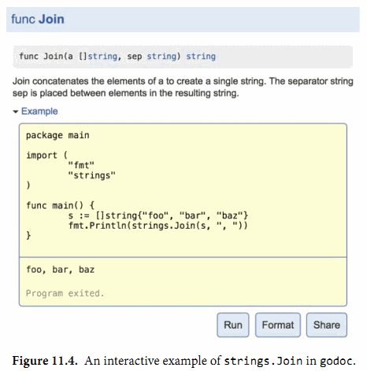

## 11.6. 示例函数

第三种 `go test` 特别处理的函数是示例函数, 以 Example 为函数名开头. 示例函数没有函数参数和返回值. 下面是 IsPalindrome 函数对应的示例函数:

```Go
func ExampleIsPalindrome() {
	fmt.Println(IsPalindrome("A man, a plan, a canal: Panama"))
	fmt.Println(IsPalindrome("palindrome"))
	// Output:
	// true
	// false
}
```

示例函数有三个用处. 最主要的一个是用于文档: 一个包的例子可以更简洁直观的方式来演示函数的用法, 会文字描述会更直接易懂, 特别是作为一个提醒或快速参考时. 一个例子函数也可以方便展示属于同一个接口的几种类型或函数直接的关系, 所有的文档都必须关联到一个地方, 就像一个类型或函数声明都统一到包一样. 同时, 示例函数和注释并不一样, 示例函数是完整真是的Go代码, 需要介绍编译器的编译时检查, 这样可以保证示例代码不会腐烂成不能使用的旧代码.

根据示例函数的后缀名部分, godoc 的web文档会将一个示例函数关联到某个具体函数或包本身, 因此 ExampleIsPalindrome 示例函数将是 IsPalindrome 函数文档的一部分, Example 示例函数将是包文档的一部分.

示例文档的第二个用处是在 `go test` 执行测试的时候也运行示例函数测试. 如果示例函数内含有类似上面例子中的 `/ Output:` 这样的注释, 那么测试工具会执行这个示例函数, 然后检测这个示例函数的标准输出和注释是否匹配.

示例函数的第三个目的提供一个真实的演练场. golang.org 是由 dogoc 提供的服务, 它使用了 Go Playground 技术让用户可以在浏览器中在线编辑和运行每个示例函数, 就像 图 11.4 所示的那样. 这通常是学习函数使用或Go语言特性的最快方式.



本书最后的两掌是讨论 reflect 和 unsafe 包, 一般的Go用于很少需要使用它们. 因此, 如果你还没有写过任何真是的Go程序的话, 现在可以忽略剩余部分而直接编码了.


