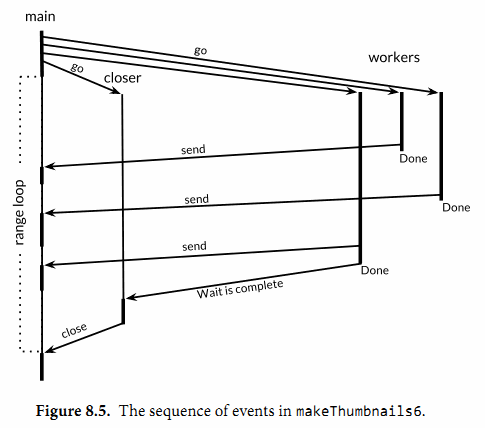

## 8.5. 并发的循环

本节中，我们会探索一些用来在并行时循环迭代的常见并发模型。我们会探究从全尺寸图片生成一些缩略图的问题。gopl.io/ch8/thumbnail包提供了ImageFile函数来帮我们拉伸图片。我们不会说明这个函数的实现，只需要从gopl.io下载它。

```go
gopl.io/ch8/thumbnail
package thumbnail
// ImageFile reads an image from infile and writes
// a thumbnail-size version of it in the same directory.
// It returns the generated file name, e.g., "foo.thumb.jpg".
func ImageFile(infile string) (string, error)
```

下面的程序会循环迭代一些图片文件名，并为每一张图片生成一个缩略图：

```go
gopl.io/ch8/thumbnail
// makeThumbnails makes thumbnails of the specified files.
func makeThumbnails(filenames []string) {
    for _, f := range filenames {
        if _, err := thumbnail.ImageFile(f); err != nil {
            log.Println(err)
        }
    }
}
```

显然我们处理文件的顺序无关紧要，因为每一个图片的拉伸操作和其它图片的处理操作都是彼此独立的。像这种子问题都是完全彼此独立的问题被叫做易并行问题(译注：embarrassingly parallel，直译的话更像是尴尬并行)。易并行问题是最容易被实现成并行的一类问题(废话)，并且是最能够享受并发带来的好处，能够随着并行的规模线性地扩展。

下面让我们并行地执行这些操作，从而将文件IO的延迟隐藏掉，并用上多核cpu的计算能力来拉伸图像。我们的第一个并发程序只是使用了一个go关键字。这里我们先忽略掉错误，之后再进行处理。

```go
// NOTE: incorrect!
func makeThumbnails2(filenames []string) {
    for _, f := range filenames {
        go thumbnail.ImageFile(f) // NOTE: ignoring errors
    }
}
```

这个版本运行的实在有点太快，实际上，由于它比最早的版本使用的时间要短得多，即使当文件名的slice中只包含有一个元素。这就有点奇怪了，如果程序没有并发执行的话，那为什么一个并发的版本还是要快呢？答案其实是makeThumbnails在它还没有完成工作之前就已经返回了。它启动了所有的goroutine，没一个文件名对应一个，但没有等待它们一直到执行完毕。

没有什么直接的办法能够等待goroutine完成，但是我们可以改变goroutine里的代码让其能够将完成情况报告给外部的goroutine知晓，使用的方式是向一个共享的channel中发送事件。因为我们已经知道内部的goroutine只有len(filenames)，所以外部的goroutine只需要在返回之前对这些事件计数。

```go
// makeThumbnails3 makes thumbnails of the specified files in parallel.
func makeThumbnails3(filenames []string) {
    ch := make(chan struct{})
    for _, f := range filenames {
        go func(f string) {
            thumbnail.ImageFile(f) // NOTE: ignoring errors
            ch <- struct{}{}
        }(f)
    }
    // Wait for goroutines to complete.
    for range filenames {
        <-ch
    }
}
```

注意我们将f的值作为一个显式的变量传给了函数，而不是在循环的闭包中声明：


```go
for _, f := range filenames {
    go func() {
        thumbnail.ImageFile(f) // NOTE: incorrect!
        // ...
    }()
}
```

回忆一下之前在5.6.1节中，匿名函数中的循环变量快照问题。上面这个单独的变量f是被所有的匿名函数值所共享，且会被连续的循环迭代所更新的。当新的goroutine开始执行字面函数时，for循环可能已经更新了f并且开始了另一轮的迭代或者(更有可能的)已经结束了整个循环，所以当这些goroutine开始读取f的值时，它们所看到的值已经是slice的最后一个元素了。显式地添加这个参数，我们能够确保使用的f是当go语句执行时的“当前”那个f。

如果我们想要从每一个worker goroutine往主goroutine中返回值时该怎么办呢？当我们调用thumbnail.ImageFile创建文件失败的时候，它会返回一个错误。下一个版本的makeThumbnails会返回其在做拉伸操作时接收到的第一个错误：

```go
// makeThumbnails4 makes thumbnails for the specified files in parallel.
// It returns an error if any step failed.
func makeThumbnails4(filenames []string) error {
    errors := make(chan error)

    for _, f := range filenames {
        go func(f string) {
            _, err := thumbnail.ImageFile(f)
            errors <- err
        }(f)}
    }

    for range filenames {
        if err := <-errors; err != nil {
            return err // NOTE: incorrect: goroutine leak!
        }
    }

    return nil
}
```

这个程序有一个微秒的bug。当它遇到第一个非nil的error时会直接将error返回到调用方，使得没有一个goroutine去排空errors channel。这样剩下的worker goroutine在向这个channel中发送值时，都会永远地阻塞下去，并且永远都不会退出。这种情况叫做goroutine泄露(§8.4.4)，可能会导致整个程序卡住或者跑出out of memory的错误。

最简单的解决办法就是用一个具有合适大小的buffered channel，这样这些worker goroutine向channel中发送测向时就不会被阻塞。(一个可选的解决办法是创建一个另外的goroutine，当main goroutine返回第一个错误的同时去排空channel)

下一个版本的makeThumbnails使用了一个buffered channel来返回生成的图片文件的名字，附带生成时的错误。

```go
// makeThumbnails5 makes thumbnails for the specified files in parallel.
// It returns the generated file names in an arbitrary order,
// or an error if any step failed.

func makeThumbnails5(filenames []string) (thumbfiles []string, err error) {
    type item struct {
        thumbfile string
        err       error
    }

    ch := make(chan item, len(filenames))
    for _, f := range filenames {
        go func(f string) {
            var it item
            it.thumbfile, it.err = thumbnail.ImageFile(f)
            ch <- it
        }(f)
    }

    for range filenames {
        it := <-ch
        if it.err != nil {
            return nil, it.err
        }
        thumbfiles = append(thumbfiles, it.thumbfile)
    }

    return thumbfiles, nil
}
```

我们最后一个版本的makeThumbnails返回了新文件们的大小总计数(bytes)。和前面的版本都不一样的一点是我们在这个版本里没有把文件名放在slice里，而是通过一个string的channel传过来，所以我们无法对循环的次数进行预测。

为了知道最后一个goroutine什么时候结束(最后一个结束并不一定是最后一个开始)，我们需要一个递增的计数器，在每一个goroutine启动时加一，在goroutine退出时减一。这需要一种特殊的计数器，这个计数器需要在多个goroutine操作时做到安全并且提供提供在其减为零之前一直等待的一种方法。这种计数类型被称为sync.WaitGroup，下面的代码就用到了这种方法：

```go
// makeThumbnails6 makes thumbnails for each file received from the channel.
// It returns the number of bytes occupied by the files it creates.
func makeThumbnails6(filenames <-chan string) int64 {
    sizes := make(chan int64)
    var wg sync.WaitGroup // number of working goroutines
    for f := range filenames {
        wg.Add(1)
        // worker
        go func(f string) {
            defer wg.Done()
            thumb, err := thumbnail.ImageFile(f)
            if err != nil {
                log.Println(err)
                return
            }
            info, _ := os.Stat(thumb) // OK to ignore error
            sizes <- info.Size()
        }(f)
    }

    // closer
    go func() {
        wg.Wait()
        close(sizes)
    }()


    var total int64
    for size := range sizes {
        total += size
    }
    return total
}
```

注意Add和Done方法的不对策。Add是为计数器加一，必须在worker goroutine开始之前调用，而不是在goroutine中；否则的话我们没办法确定Add是在"closer" goroutine调用Wait之前被调用。并且Add还有一个参数，但Done却没有任何参数；其实它和Add(-1)是等价的。我们使用defer来确保计数器即使是在出错的情况下依然能够正确地被减掉。上面的程序代码结构是当我们使用并发循环，但又不知道迭代次数时很通常而且很地道的写法。

sizes channel携带了每一个文件的大小到main goroutine，在main goroutine中使用了range loop来计算总和。观察一下我们是怎样创建一个closer goroutine，并让其等待worker们在关闭掉sizes channel之前退出的。两步操作：wait和close，必须是基于sizes的循环的并发。考虑一下另一种方案：如果等待操作被放在了main goroutine中，在循环之前，这样的话就永远都不会结束了，如果在循环之后，那么又变成了不可达的部分，因为没有任何东西去关闭这个channel，这个循环就永远都不会终止。

图8.5 表明了makethumbnails6函数中事件的序列。纵列表示goroutine。窄线段代表sleep，粗线段代表活动。斜线箭头代表用来同步两个goroutine的事件。时间向下流动。注意main goroutine是如何大部分的时间被唤醒执行其range循环，等待worker发送值或者closer来关闭channel的。



**练习 8.4：** 修改reverb2服务器，在每一个连接中使用sync.WaitGroup来计数活跃的echo goroutine。当计数减为零时，关闭TCP连接的写入，像练习8.3中一样。验证一下你的修改版netcat3客户端会一直等待所有的并发“喊叫”完成，即使是在标准输入流已经关闭的情况下。

**练习 8.5：** 使用一个已有的CPU绑定的顺序程序，比如在3.3节中我们写的Mandelbrot程序或者3.2节中的3-D surface计算程序，并将他们的主循环改为并发形式，使用channel来进行通信。在多核计算机上这个程序得到了多少速度上的改进？使用多少个goroutine是最合适的呢？
